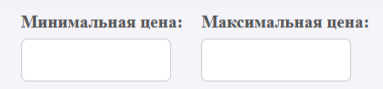
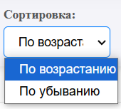
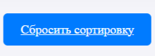

# Фудзияма (Меню)
Это сайт, который отображает меню суши ресторана с доставкой Фудзияма с возможностью фильтрации по цене и сортировки продуктов.

---
## Функционал
**Фильтрация по цене:** Пользователи могут установить минимальную и максимальную цену для отображаемых продуктов.

**Сортировка:**
- По возрастанию цены.
- По убыванию цены.
Сбросить сортировку и вернуть продукты в том порядке, как они находятся в базе данных (по умолчанию сортировка идет по ID).

 ---
## Требованию к поднятию:
- Наличие Docker
- Запуск с помощью скрипта build.sh
Скрипт выполнит все необходимые шаги для создания Docker-образа, запуска контейнера и настройки приложения.

---
## Доступ к приложению
После того как контейнер будет запущен, приложение будет доступно по адресу http://localhost:5000/.

---
## Интерфейс
Главная страница с продуктами: На главной странице отображаются продукты.
#### Фильтрация по максимальной и минимальной цене

#### Сортировка по возрастанию и убыванию

#### Сортировка и фильтрация срабатывают после нажатия кнопки "Применить"

#### Кнопка сброса сортировки позволяет посмотреть меню в том порядке, в каком оно извлекается с сайта

---
## Структура проекта
- app.py — основной файл приложения, содержащий настройку Flask и логику.
- scraper.py — модуль, который отвечает за парсинг данных с внешнего сайта и загрузку их в базу данных.
- templates — папка с шаблонами HTML.
- index.html — основной шаблон для отображения страницы с продуктами.
- static — папка с файлами стилей и изображениями.
- requirements.txt — файл с зависимостями для установки.
- Dockerfile — файл для создания Docker-образа.
- docker-compose.yml — файл для настройки развертывания через Docker Compose.
- build.sh — скрипт для сборки и запуска проекта в Docker.
